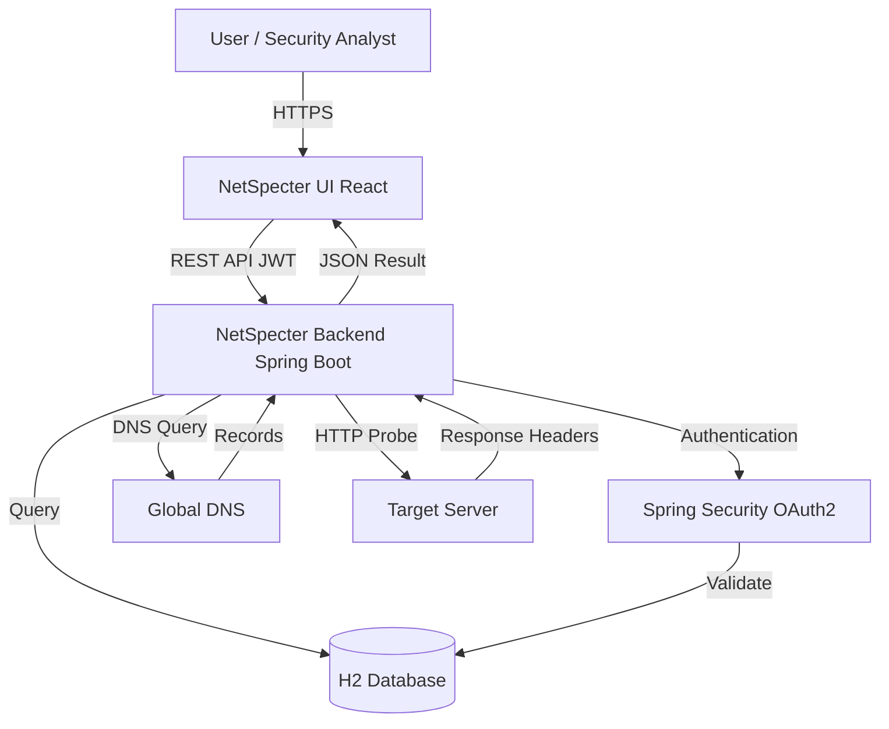

# NetSpecter Architecture Overview

## 1. High-Level Architecture

NetSpecter is designed as a **Service-Oriented Architecture (SOA)** with a clear separation of concerns between the presentation layer, business logic layer, and data persistence layer.

### System Components

1.  **Client (Presentation Layer)**:
    *   **Tech Stack**: React, TypeScript, Vite.
    *   **Role**: Handles user interaction, visualization of scan results, and authentication flows.
    *   **Communication**: Consumes the Backend API via REST over HTTP/HTTPS.

2.  **API Gateway / Backend (Business & Security Layer)**:
    *   **Tech Stack**: Java 17, Spring Boot 3.3, Spring Security.
    *   **Role**:
        *   **Security Core**: Handles Authentication (JWT + OAuth2) and Authorization.
        *   **Scan Engine**: Orchestrates the "Specter" scanning logic (DNS, Headers, Threat Scoring).
        *   **API Exposure**: Provides secure endpoints for the frontend.

3.  **Data Persistence Layer**:
    *   **Tech Stack**: H2 Database (In-Memory for speed/demo) or PostgreSQL (Production ready).
    *   **Role**: Stores User credentials (hashed), roles, and potentially scan history.

---

## 2. Security Architecture

Security is the backbone of NetSpecter. We employ a **Defense-in-Depth** strategy:

### Authentication & Authorization
*   **JWT (JSON Web Tokens)**: Stateless authentication. Upon login, the server issues a signed JWT containing user claims. The client must present this token in the `Authorization: Bearer <token>` header for all subsequent requests.
*   **OAuth2 / OpenID Connect**: Integration with Google for seamless "Sign in with Google" functionality.
*   **BCrypt Hashing**: All user passwords are salt-hashed using BCrypt before storage.
*   **Role-Based Access Control (RBAC)**: Differentiates between regular `USER` and `ADMIN` privileges (prepared for future features).

### API Security
*   **CORS Configuration**: strict Cross-Origin Resource Sharing policies to allow legitimate frontend requests while blocking unauthorized origins.
*   **CSRF Protection**: Disabled for stateless API endpoints (standard for JWT-based auth), but can be enabled for session-based flows.
*   **Input Sanitation**: All scan targets are sanitized to prevent Command Injection or SSRF attacks.

---

## 3. The "Specter" Scan Engine Logic

The core value proposition of NetSpecter is its scanning algorithm:

1.  **Target Parsing**:
    *   Intelligently detects proper inputs: Email (`user@company.com`), IP (`1.1.1.1`), or Domain (`example.com`).
    *   For emails, it automatically pivots to the domain (`company.com`) for infrastructure scanning.

2.  **Reconnaissance Phase**:
    *   **DNS Enumeration**: Queries generic nameservers for A, MX, and TXT records using `dnsjava`.
    *   **Header Analysis**: Sends a specialized `HEAD` request to the target to inspect HTTP Security Headers (HSTS, CSP, X-Frame-Options).

3.  **Threat Scoring Algorithm**:
    *   Findings are weighted by severity (e.g., Missing CSP = High Risk).
    *   A cumulative score (0-100) is calculated.
    *   **Codename Generation**: A deterministic hash function generates a unique "Operation Codename" (e.g., "Operation Red Wolf") for every target, adding a layer of immersive UX.

---

## 4. Deployment Architecture (Render)

The application is containerized and deployed using Infrastructure as Code (IaC) via a `render.yaml` blueprint.

*   **Net-Specter-Backend**:
    *   Built from `Dockerfile` (Multi-stage build: Maven Build -> JDK Alpine Runtime).
    *   Exposes port `8080`.
    *   Environment variables injected at runtime.
*   **Net-Specter-UI**:
    *   Built as a Static Site (Node.js build -> Static Assets).
    *   Served via Render's global CDN.
    *   Directly communicates with the Backend service.

---

## 5. Data Flow Diagram

